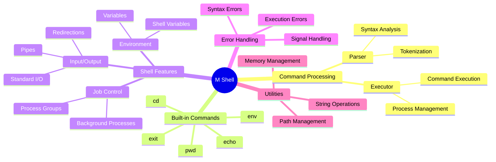

# M Shell Project Mindmap

```mermaid
mindmap
  root((M Shell))
    Command Processing
      Parser
        Tokenization
        Syntax Analysis
      Executor
        Command Execution
        Process Management
    Built-in Commands
      cd
      pwd
      exit
      echo
      env
    Shell Features
      Input/Output
        Standard I/O
        Redirections
        Pipes
      Environment
        Variables
        Shell Variables
      Job Control
        Background Processes
        Process Groups
    Error Handling
      Syntax Errors
      Execution Errors
      Signal Handling
    Utilities
      String Operations
      Path Management
      Memory Management
```
